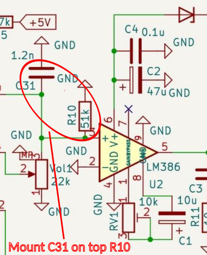
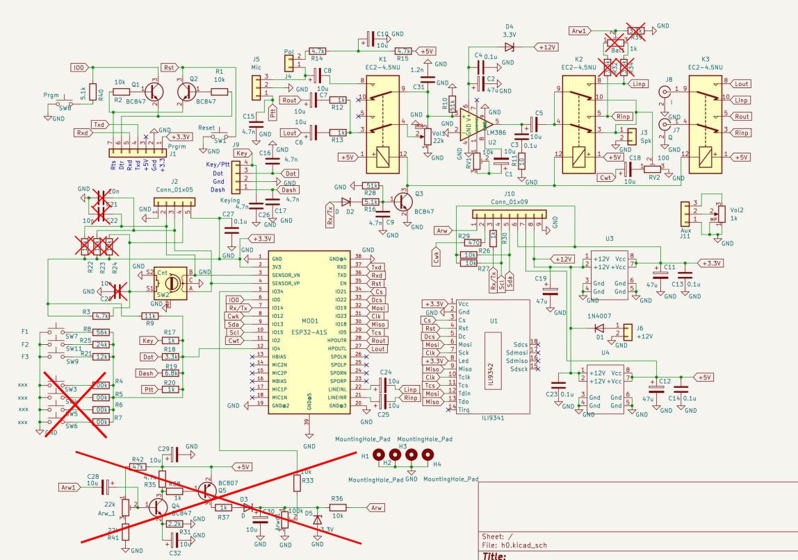

Practical tip for mounting anti noise capacitor C31.
The LM386 amplifier may sometimes oscillate at frequencies ranging from several tens of kilohertz to nearly 200 kHz (this is visible on the output when an oscilloscope is connected and is indicated by an operating current exceeding 100 mA). To prevent this, capacitor C31 should be soldered close to the LM386 chip; a good solution is to solder C31 directly onto resistor R10.

The system can be operated in a basic configuration without the AGC system and redundant components. The drawing shows which components do not need to be installed in such a case.

