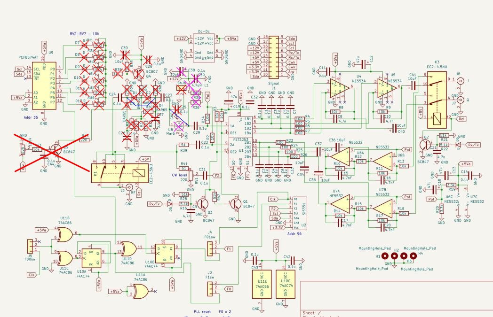

The system can be operated in a basic configuration without the AGC system and redundant components. The drawing shows which components do not need to be installed in such a case.
The red markings refer to the PIN diode attenuator. The purple markings refer to the input amplifier, which results in reduced receiver sensitivity. In both cases, the jumpers marked in blue must be installed.

